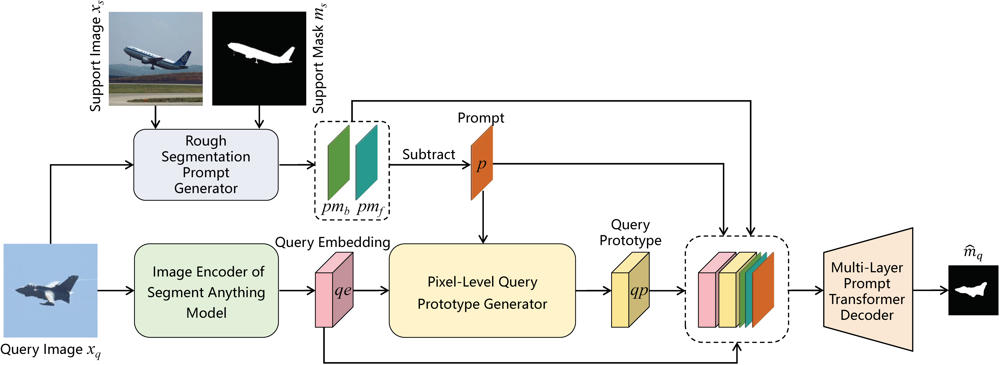

# SAM-RSP: A New Few-Shot Segmentation Method Based on Segment Anything Model and Rough Segmentation Prompts

> **Abstract:** Few-shot segmentation (FSS) aims to segment novel classes with a few labeled images. The backbones used in existing methods are pre-trained through classification tasks on the ImageNet dataset. Although these backbones can effectively perceive the semantic categories of images, they cannot accurately perceive the regional boundaries within one image, which limits the model performance. Recently, Segment Anything Model (SAM) has achieved precise image segmentation based on point or box prompts, thanks to its excellent perception of region boundaries within one image. However, it cannot effectively provide semantic information of images. This paper proposes a new few-shot segmentation method that can effectively perceive both semantic categories and regional boundaries. This method first utilizes the SAM encoder to perceive regions and obtain the query embedding. Then the support and query images are input into a backbone pre-trained on ImageNet to perceive semantics and generate a rough segmentation prompt (RSP). This query embedding is combined with the prompt to generate a pixel-level query prototype, which can better match the query embedding. Finally, the query embedding, prompt, and prototype are combined and input into the designed multi-layer prompt transformer decoder, which is more efficient and lightweight, and can provide a more accurate segmentation result. In addition, other methods can be easily combined with our framework to improve their performance. Plenty of experiments on PASCAL-5<sup>i</sup> and COCO-20<sup>i</sup> under 1-shot and 5-shot settings prove the effectiveness of our method. Our method also achieves new state-of-the-art.

<p align="middle">
  
</p>

### Dependencies

- RTX 3090
- Python 3.8
- PyTorch 1.12.0
- cuda 11.6
- torchvision 0.13.0
- tensorboardX 2.2


### Datasets

- PASCAL-5<sup>i</sup>:  [VOC2012](http://host.robots.ox.ac.uk/pascal/VOC/voc2012/) + [SBD](http://home.bharathh.info/pubs/codes/SBD/download.html)

- COCO-20<sup>i</sup>:  [COCO2014](https://cocodataset.org/#download)
- Put the datasets into the `data/` directory.
- Run `util/get_mulway_base_data.py` to generate base annotations and put them into the `data/base_annotation/` directory. (Only used when the coarse segmentation prompt generator is BAM.)

### Models

- Download the pre-trained [VGG16](https://download.pytorch.org/models/vgg16_bn-6c64b313.pth) and [ResNet50](https://download.pytorch.org/models/resnet50-19c8e357.pth) encoders and put them into the `initmodel/` directory. 
- Download the pre-trained [SAM](https://dl.fbaipublicfiles.com/segment_anything/sam_vit_l_0b3195.pth) encoder and put it into the `initmodel/SAM_encoder/` directory.
- Download the pre-trained [BAM](https://github.com/chunbolang/BAM) models and put them into the `initmodel/BAM_models/` directory. (Only used when the coarse segmentation prompt generator is BAM.)
- Download the pre-trained base learners from [BAM](https://github.com/chunbolang/BAM) and put them under `initmodel/PSPNet/`. (Only used when the coarse segmentation prompt generator is BAM.)


### Scripts

- Change configuration and add weight path to `.yaml` files in `config` directory, then run the `train.sh` file for training or `test.sh` file for testing.

### Performance

Performance comparison with the state-of-the-art approachs in terms of **average** **mIoU** across all folds. 

1. ##### PASCAL-5<sup>i</sup>

   | Backbone  | Method       | 1-shot                   | 5-shot                   |
   | --------  | ------------ | ------------------------ | ------------------------ |
   | VGG16     | MIANet       | 67.10                    | 71.99                    |
   |           | SAM-RSP(ours)| 69.29 <sub>(+2.19)</sub> | 73.86 <sub>(+1.87)</sub> |
   | ResNet50  | HDMNet       | 69.40                    | 71.80                    |
   |           | SAM-RSP(ours)| 70.76 <sub>(+1.36)</sub> | 74.15 <sub>(+2.35)</sub> |
   

2. ##### COCO-20<sup>i</sup>

   | Backbone  | Method       | 1-shot                   | 5-shot                   |
   | --------  | ------------ | ------------------------ | ------------------------ |
   | VGG16     | HDMNet       | 45.90                    | 52.40                    |
   |           | SAM-RSP(ours)| 48.79 <sub>(+2.89)</sub> | 54.15 <sub>(+1.75)</sub> |
   | ResNet50  | MIANet       | 47.66                    | 51.65                    |
   |           | SAM-RSP(ours)| 49.84 <sub>(+2.18)</sub> | 55.38 <sub>(+3.73)</sub> |
   
   

This paper is currently being reviewed by the Image and Vision Computing journal.


## References

This repo is mainly built based on [SAM](https://segment-anything.com), and [BAM](https://github.com/chunbolang/BAM). Thanks for their great work!

````
